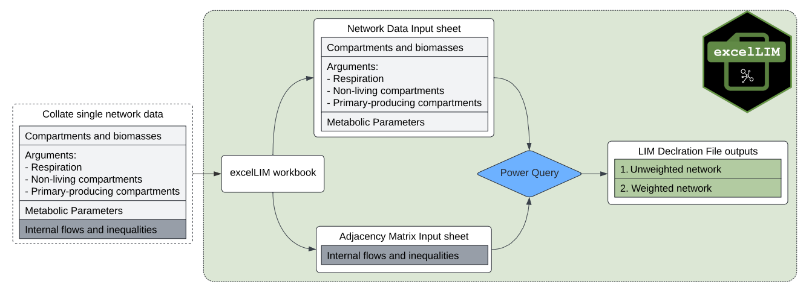
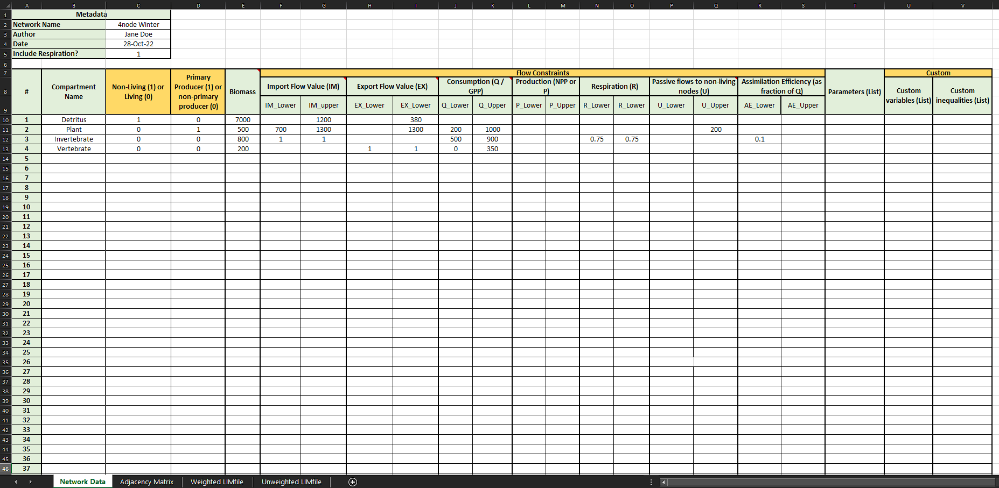
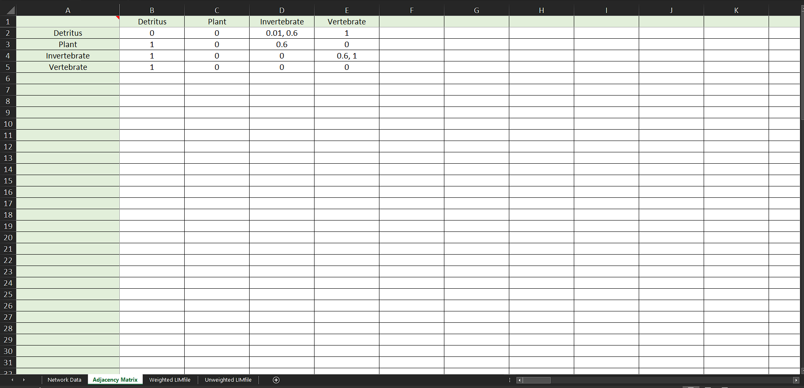

```{r setup, include=FALSE}
knitr::opts_chunk$set(echo = TRUE)
```

# Introduction 

A popular method of incorporating data uncertainty in ecological models is by using using linear inverse modelling with Markov Chain Monte Carlo (LIM-MCMC) methods to calculate multiple plausible networks within the ecological constraints.
Commonly, this is achieved by using opensource R and R package [LIM](https://cran.r-project.org/web/packages/LIM/index.html)
(van Oevelen et al., 2010), and embedded R package [limSolve](https://cran.r-project.org/web/packages/limSolve/index.html) 
(Soetaert et al., 2009). 

To use these packages, all input data on network structure (compartments and directed flows) and flow constraints (lower and upper bounds) need to be manually coded into linear equations and declared in particular sections in a LIM-readable text file, the so-called 'LIM declaration file' (van Oevelen et al., 2010). For small networks, the manual construction of a LIM declaration file is straightforward but becomes less manageable in terms of complexity and time as network size increases.

To support researchers in translating network model input data into LIM declaration files, we developed 
[excelLIM](https://github.com/gemmagerber/excelLIM)
: an automated LIM declaration file code translator with Microsoft Excel 2016. [excelLIM](https://github.com/gemmagerber/excelLIM)
is a spreadsheet-based tool for novice network builders, automatically coding network input data into ready-to-use LIM declaration files describing both weighted and unweighted network models that feed directly into R packages [LIM](https://cran.r-project.org/web/packages/LIM/index.html)
and
limSolve [limSolve](https://cran.r-project.org/web/packages/limSolve/index.html).
The entire LIM declaration file coding process is done within the 
[excelLIM](https://github.com/gemmagerber/excelLIM)
workbook and is therefore user-friendly to researchers with limited experience using R. 

The automation saves time and effort, reduces coding error rates, and can be applied to networks of up to one hundred compartments. While our example focuses on ecological networks,
[excelLIM](https://github.com/gemmagerber/excelLIM)
is easily adaptable to a variety of system science disciplines. By removing a barrier in the network construction process,
[excelLIM](https://github.com/gemmagerber/excelLIM) 
can improve the uptake of data uncertainty in network modelling with LIM-MCMC methods. 


# Software Requirements & Getting Started

[excelLIM](https://github.com/gemmagerber/excelLIM)
was implemented in Microsoft Excel 2016 (Microsoft, 2016) and R (v 4.2.0) (R Core Team, 2022), and is compatible with Microsoft 2013 and R v >= 4.2.0.
[excelLIM](https://github.com/gemmagerber/excelLIM) 
has no dependencies and can be used without loading it's sister R package __autoLIMR__. __autoLIMR__ has a host of functions that integrates
[excelLIM](https://github.com/gemmagerber/excelLIM)
if users wish to use both applications together. 

The latest version of
[excelLIM](https://github.com/gemmagerber/excelLIM)
can be download from the 
[__excelLIM__ GitHub repository](https://github.com/gemmagerber/__excelLIM__)
or downloaded to the working directory with the __autoLIMR__ function `autoLIMR::fetch_excelLIM()` during an active R session. Please set `force = TRUE` to give R permission to download
[excelLIM](https://github.com/gemmagerber/excelLIM) 
and save to the working directory.

```{r, eval = FALSE}
autoLIMR::fetch_excelLIM(force = TRUE)
```


# __excelLIM__ workflow overview

[excelLIM](https://github.com/gemmagerber/excelLIM)
consists of two input sheets. The first, 'Network Input Data' sheet contains all compartment names, biomasses, and metabolic constraints. 
The second, ‘Adjacency Matrix’ sheet, contains a network matrix of intercompartmental flows including predator-prey interactions and unassimilated energy/material flows to the detrital pools. Once both datasheets have been populated with data,
[excelLIM](https://github.com/gemmagerber/excelLIM)
codes the data into sets of linear equations, arrange the linear equations into LIM-required sections, and outputs ready-to-use LIM declaration files in two output sheets. The first output sheet contains the 'unweighted' network LIM declaration file. The second output sheet contains the equivalent 'weighted' network LIM declaration file (Figure \@ref(fig:workflow)).

```{r workflow, echo = FALSE, out.width = "100%", fig.align = 'center', fig.cap = "___excelLIM__ workflow from input data to LIM declaration file_"}

```

# User Guide

Here we discuss the general principles of how to use
[excelLIM](https://github.com/gemmagerber/excelLIM) to produce
LIM declaration files from input data. We use a single conceptual four-compartment food web network as an example (Figure \@ref(fig:network)).

```{r network, echo = FALSE, out.width = "75%", fig.align = 'center', fig.cap = "_Conceptual four-compartment food web with flows depicting exchanges between compartments within and across a defined system boundary._"}
knitr::include_graphics("images/network.PNG")
```


## Data requirements

Prior to using
[excelLIM](https://github.com/gemmagerber/excelLIM),
all network data are calculated to a specific model currency or defined as proportions of another variable (see Fath et al., 2007; Scharler and Borrett, 2021 for details). In our example, the model currency is in units of carbon, i.e., mg C·m^--2^ for compartment biomasses, and mg C·m^--2^·day^--1^ for flows.

## Data input

[excelLIM](https://github.com/gemmagerber/excelLIM)
requires the user to differentiate and store the required network data in two separate sheets. The first, 'Network Input Data' sheet, contains network information on: 1) internal compartment names, 2) their respective biomasses, and 3) compartment-specific metabolic constraints. The arguments for respiration, non-living nodes, and primary producers are also in this sheet, and are simple binary arguments. The second sheet 'Adjacency Matrix' contains all internal compartment interactions (flows) and constraints orientated in a row-to-column format. We discuss the data input for each sheet below.

### Network Data Input sheet

In the network data input sheet (Figure \@ref(fig:netinput)), users enter in network metadata (network name, author, date) and a binary argument of whether respiration is included in the network (`1` for 'Yes', `0` for 'No'). Next, the final list of aggregated internal compartments should be listed under the column heading 'Compartment Name'. Each row should correspond to exactly one compartment. Next, users use binary arguments (`1` for 'Yes', `0` for 'No') to define whether each compartment is non-living or living, and whether each compartment is a primary producer or consumer. Each compartments respective biomasses should be entered under the column heading “Biomass”. 

Additional columns in each network data table separately describe lower and upper bounds for living compartment physiological constraints, such as Consumption (Q) (or the equivalent gross primary production (_GPP_) in the case of primary producers), Production (_P_) (or the equivalent Net Primary Production (_NPP_) in the case of primary producers), unused material/energy (egestion and mortality combined) (_U_), and assimilation efficiency (_AE_) (as a fraction of total consumption).  

For both living and non-living compartments, imports from across the system boundary (_IM_), and exports from outside of the system boundary (_EX_) are included. If _IM_ and _EX_ flows exist and the inequalities are known, the user inputs separate lower and upper inequalities in separate columns headings. If a compartment receives an import or export, but the inequalities are not known, the user inputs a “1” in the respective columns. If no import or export to the compartment exist exists, the user can leave the respective cell blank or enter “0”, and no external compartment will be generated. 


```{r netinput, echo = FALSE, out.width = "100%", fig.align = 'center', fig.cap = "___excelLIM__ Network Input sheet_"}

```

### Adjacency Matrix sheet

The adjacency matrix sheet (Figure \@ref(fig:admat)) contains all flows and flow constraints from compartment in row _i_ to compartment in column _j_.
[excelLIM](https://github.com/gemmagerber/excelLIM) 
automatically pulls all compartment names from the Network Input Data sheet into rows and columns in the adjacency matrix. Flows between the source (row _i_) and the recipient (column _j_) are defined by `1` or as constraints in the form of `lower value, upper value`. For example, `0.2,0.5` indicates that a flow from a specific source (row _i_) comprises 20 – 50 % of the compartment _j_’s total consumptive input.

```{r admat, echo = FALSE, out.width = "100%", fig.align = 'center', fig.cap = "___excelLIM__ Adjacency Matrix sheet_"}

```

## LIM declaration file translation

Depending on the supplied information for Network Input Data and the Adjacency Matrices,
[excelLIM](https://github.com/gemmagerber/excelLIM)
formats the input data into sets of linear equations that are compatible with [LIM](https://cran.r-project.org/web/packages/LIM/index.html) and [limSolve](https://cran.r-project.org/web/packages/limSolve/index.html), and arranges them into LIM declaration file sections. The linear equations define compartments and their weights, external compartments and external flows (exchanges with external CO2 compartments, imports, and exports), intercompartmental flows and inequalities, and compartment specific metabolic inequalities (constraints). Here we discuss the translation details of information from each of the Network Input Data and Adjacency Matrices inputs into LIM compatible declaration files.

### Network Input Data translation

From the Network Input Data,
[excelLIM](https://github.com/gemmagerber/excelLIM) defines 1) Compartment equalities list, 2) External compartments list, 3) metabolic flows and inequalities, 4) boundary flows and inequalities, and 5) mass-balance variables. 

For compartments defined as 'non-living',
[excelLIM](https://github.com/gemmagerber/excelLIM) 
attaches a “NLNode” text string to the compartment name (e.g., `DetritusNLNode`). [excelLIM](https://github.com/gemmagerber/excelLIM)
codes the list of compartments together with their respective biomasses into biomass equalities, arranges the non-living compartments to the bottom of the list, and places them within a LIM compatible section starting with the heading `### COMPARTMENTS` and ending with the section ending `### END COMPARTMENTS`. As a failsafe, 
[excelLIM](https://github.com/gemmagerber/excelLIM)
will not create any code for a network compartment if the compartment biomass is less than or equal to zero. 

[excelLIM](https://github.com/gemmagerber/excelLIM)
generates external compartments based on the presence of 1) whether respiration is included, and 2) whether input and export inequalities are defined for each compartment. If respiration is included in the network model,
[excelLIM](https://github.com/gemmagerber/excelLIM) generates an external `CO2` compartment to include in the externals list. If imports and exports for internal compartments are defined, 
[excelLIM](https://github.com/gemmagerber/excelLIM) generates external compartments for each import and export. For compartments with defined imports, [excelLIM](https://github.com/gemmagerber/excelLIM) codes an external compartment by attaching an 'Import' string to the compartment name (e.g. `InvertebrateImport`). For compartments with defined exports, external compartments are coded by attaching an 'Export' text string to the internal compartment name (e.g., `InvertebrateExport`). Unlike the internal compartment list, no biomasses equalities are generated for the external compartments. [excelLIM](https://github.com/gemmagerber/excelLIM) arranges the automatically defined external list such that, if respiration is included in the model, `CO2` is listed first. [excelLIM](https://github.com/gemmagerber/excelLIM) then places the externals list into the LIM compatible section starting with the heading `### EXTERNALS` and ending with the section ending `### END EXTERNALS`. 

If respiration has been included in the model, [excelLIM](https://github.com/gemmagerber/excelLIM) defines respiration flows as the flow from each living compartment to the external CO2 sink (Le Guen et al., 2019) e.g., `Invertebrate_R: Invertebrate -> CO2`. No respiration flows are generated for non-living compartments. For primary producer compartments, [excelLIM](https://github.com/gemmagerber/excelLIM) further generates a _GPP_ flow, defining the flow from the external CO2 sink to the primary producing compartments (e.g., `Plant_GPP: CO2 -> Plant`). Where compartmental imports have been defined, [excelLIM](https://github.com/gemmagerber/excelLIM) generates a flow describing the flow of energy from the external compartment to the internal compartment (e.g., `Invertebrate_IM: InvertebrateImport -> Invertebrate`). Where exports from each compartment have been defined, [excelLIM](https://github.com/gemmagerber/excelLIM) generates an export flow describing the flow of energy from the internal compartment to the external export compartment (e.g., `Invertebrate_EX: Invertebrate -> InvertebrateExport`). [excelLIM](https://github.com/gemmagerber/excelLIM) gathers the boundary flows and arranges them with all flows containing CO2 first, if applicable, with headings delineating each flow type within the LIM declaration file. If inequality values are provided for each boundary flow (respiration, imports, exports), [excelLIM](https://github.com/gemmagerber/excelLIM) will further generate an inequality for each value provided.

For living compartments, [excelLIM](https://github.com/gemmagerber/excelLIM) defines mass balance equations to balance the sum of inputs and outputs (i.e. input = output) for each compartment (Fath et al., 2007). If both respiration and unused material has been included in [excelLIM](https://github.com/gemmagerber/excelLIM) arguments, mass balance equations are defined as Q = P + R + U, where Q is the total consumption, P is the production, R is the respiration, and U is the total unused energy/material flowing to the non-living compartments. [excelLIM](https://github.com/gemmagerber/excelLIM) automatically rearranges the mass-balance equations suitable for the LIM Declaration file as P = Q – R – U. The mass-balance equations are automatically changed depending on whether respiration, unused material, imports, and exports are included or not (e.g. P = Q – R, P = Q – U). The general mass-balance equation is automatically updated for autotroph compartments as _NPP_ = _GPP_ - _R_ - _U_, where _NPP_ is the Net Primary Production. 

Where compartments are defined as heterotrophs, the total consumptive input into the compartment is defined as the total consumption (Q). Total consumption is automatically defined as the sum of all consumption values across a number of partitioned diet flows (e.g. Invertebrate_Q = Flowto(Invertebrate)) (van Oevelen et al., 2010). [excelLIM](https://github.com/gemmagerber/excelLIM) further describes Production and Unused Material/energy as variables and lists them with vanity headings under the `### VARIABLES` section. 


### Adjacency Matrix translation

From the adjacency matrix input sheet, for a user-defined flow between source row _i_ and recipient column _j_, [excelLIM](https://github.com/gemmagerber/excelLIM) automatically generates and stores the flowname and flow for the particular exchange between _i_ and _j_ as `flowname: i -> j`. [excelLIM](https://github.com/gemmagerber/excelLIM) defines flow names with ‘_Q_’ if the flow describes a consumptive flow from one living or non-living compartment to a living compartment, e.g., `DetritusNLNode_Q_Invertebrate` describes the consumption of Detritus (row _i_) by Invertebrate (column _j_). [excelLIM](https://github.com/gemmagerber/excelLIM) defines flow names with ‘_U_’ if the flow describes an unassimilated energy/material or mortality flow from a living compartment (row _i_) to a non-living compartment (column _j_), e.g., `Invertebrate_U_DetritusNLNode` is the flow of unassimilated material/energy and mortality from Invertebrate to Detritus. If flow constraints are included in the adjacency matrix, [excelLIM](https://github.com/gemmagerber/excelLIM) generates and stores both a flow definition and the relative inequality for that flow.  

### Combining translated code into the final LIM declaration file 

After populating both [excelLIM](https://github.com/gemmagerber/excelLIM) input sheets, the user selects the 'Data' tab and 'Refresh All', or hotkey `Ctrl+Alt+F5` (Microsoft Excel 2016) to activate several pre-coded Excel’s Power Query functions that select and arrange the generated linear equations into appropriate LIM declaration sections, and to finally gather the sections into two complete, independent LIM declaration text output sheets. The first sheet contains a weighted LIM declaration file, containing ‘weights’ for each flow in the form of inequalities that reflect the constraints as upper and lower bounds, where applicable. The second sheet contains an unweighted LIM declaration file, which shares the same format as the weighted LIM declaration file but does not contain any flow weights. 

Users can copy and paste the text directly into an R script (`.R` extension) or use __autoLIMR__ package read-in function `autoLIMR::import_autoLIMExcel_limfile()` to extract the LIM declaration from [excelLIM](https://github.com/gemmagerber/excelLIM) into R. The argument `weighted = TRUE` imports the [excelLIM](https://github.com/gemmagerber/excelLIM) generated weighted LIM declaration file, whereas `weighted = FALSE` imports the unweighted LIM declaration file.

```{r, eval = FALSE}
autoLIMR::import_autoLIMExcel_limfile(
file = "excelLIM.xlsx",
weighted = TRUE,
limname = NULL,
open_script = FALSE
)
```

Here is an example of a weighted LIM declaration file constructed using [excelLIM](https://github.com/gemmagerber/excelLIM). 

```{r, eval = FALSE}
! Weighted Network
! 4node Winter Network LIM Declaration File
! Composed with __excelLIM__
! Author: Jane Doe
! Date: 23.Oct.2022

! Respiration included: Yes
! U included: Yes

! Living compartments: 3
! Non-living compartments: 1
! External compartments: 7
! Boundary flows: 7
! Internal flows: 7

! Abbreviations
! GPP = Gross Primary Production (Primary Producers only)
! Q = Consumption
! NPP = Net Primary Production (Primary Producers only)
! P = Production
! R = Respiration
! U = Passive flows to non-living compartments/Unassimilated material
! AE = Assimilation Efficiency
! IM = Import flow
! EX = Export flow
! NLNode = Non-living compartment

### COMPARTMENTS

Invertebrate = 800
Plant = 500
Vertebrate = 200
DetritusNLNode = 7000

### END COMPARTMENTS

### EXTERNALS

CO2
DetritusNLNodeImport
InvertebrateImport
PlantImport
DetritusNLNodeExport
PlantExport
VertebrateExport

### END EXTERNALS

### VARIABLES

! Consumption (Q) / Gross Primary Production (GPP) Variables

Invertebrate_Q = Flowto(Invertebrate) - Invertebrate_IM
Plant_GPP = Flowto(Plant) - Plant_IM
Vertebrate_Q = Flowto(Vertebrate)

! Production (P/NPP) Variables

Invertebrate_P = Flowfrom(Invertebrate) - Invertebrate_R - Invertebrate_U
Plant_NPP = Flowfrom(Plant) - Plant_R - Plant_U - Plant_EX
Vertebrate_P = Flowfrom(Vertebrate) - Vertebrate_R - Vertebrate_U - Vertebrate_EX

! Unused Energy/Material (U) Variables

Invertebrate_U = Flowto(Invertebrate) - Invertebrate_P - Invertebrate_R
Plant_U = Flowto(Plant) - Plant_NPP - Plant_R - Plant_EX
Vertebrate_U = Flowto(Vertebrate) - Vertebrate_P - Vertebrate_R - Vertebrate_EX

! Assimilation Efficiency (AE) Variables

Invertebrate_AE = Invertebrate_P + Invertebrate_R

### END VARIABLES

### FLOWS

! GPP Flows

Plant_GPP: CO2 -> Plant

! Respiration flows

Plant_R: Plant -> CO2
Invertebrate_R: Invertebrate -> CO2
Vertebrate_R: Vertebrate -> CO2

! Import flows

DetritusNLNode_IM: DetritusNLNodeImport -> DetritusNLNode
Invertebrate_IM: InvertebrateImport -> Invertebrate
Plant_IM: PlantImport -> Plant

! Export flows

DetritusNLNode_EX: DetritusNLNode -> DetritusNLNodeExport
Plant_EX: Plant -> PlantExport
Vertebrate_EX: Vertebrate -> VertebrateExport

! Adjacency Matrix Flows

DetritusNLNode_Q_Invertebrate: DetritusNLNode -> Invertebrate
DetritusNLNode_Q_Vertebrate: DetritusNLNode -> Vertebrate
Invertebrate_Q_Vertebrate: Invertebrate -> Vertebrate
Invertebrate_U_DetritusNLNode: Invertebrate -> DetritusNLNode
Plant_Q_Invertebrate: Plant -> Invertebrate
Plant_U_DetritusNLNode: Plant -> DetritusNLNode
Vertebrate_U_DetritusNLNode: Vertebrate -> DetritusNLNode

### END FLOWS

### INEQUALITIES

! Network Data Input Inequalities

Plant_GPP > 200
Invertebrate_Q > 500
Plant_GPP < 1000
Invertebrate_Q < 900
Vertebrate_Q < 350
Invertebrate_R > 0.75
Invertebrate_R < 0.75
Plant_U < 200
Plant_IM > 700
DetritusNLNode_IM < 1200
Plant_IM < 1300
DetritusNLNode_EX < 380
Plant_EX < 1300
Invertebrate_AE > Invertebrate_Q * 0.1

! Adjacency Matrix Inequalities

DetritusNLNode_Q_Invertebrate = Invertebrate_Q * [0.01, 0.6]
Plant_Q_Invertebrate < Invertebrate_Q * 0.6
Invertebrate_Q_Vertebrate = Vertebrate_Q * [0.6, 1]

### END INEQUALITIES


```

# References
* Fath, B.D., Scharler, U.M., Ulanowicz, R.E., Hannon, B., 2007. _Ecological network analysis: network construction_. Ecological Modelling. 208, 49–55. https://doi.org/10.1016/J.ECOLMODEL.2007.04.029
* Le Guen, C., Tecchio, S., Dauvin, J.C., De Roton, G., Lobry, J., Lepage, M., Morin, J., Lassalle, G., Raoux, A. and Niquil, N., 2019. _Assessing the ecological status of an estuarine ecosystem: Linking biodiversity and food-web indicators_. Estuarine, Coastal and Shelf Science, 228, p.106339. https://doi.org/10.1016/j.ecss.2019.106339
* R Core Team, 2022. R: _A language and environment for statistical computing_. https://doi.org/https://www.r-project.org/
* Scharler, U.M., Borrett, S.R., 2021. _Network construction, evaluation and documentation: A guideline_. Environ. Model. Softw. 140, 105020. https://doi.org/https://doi.org/10.1016/j.envsoft.2021.105020
* Soetaert, K., van den Meersche, K., van Oevelen, D., 2009. _limSolve: Solving Linear Inverse Models_. https://doi.org/https://cran.r-project.org/package=limSolve
* van Oevelen, D., van den Meersche, K., Meysman, F.J.R., Soetaert, K., Middelburg, J.J., Vézina, A.F., 2010. _Quantifying food web flows using linear inverse models_. Ecosystems 13, 32–45. https://doi.org/10.1007/s10021-009-9297-6
